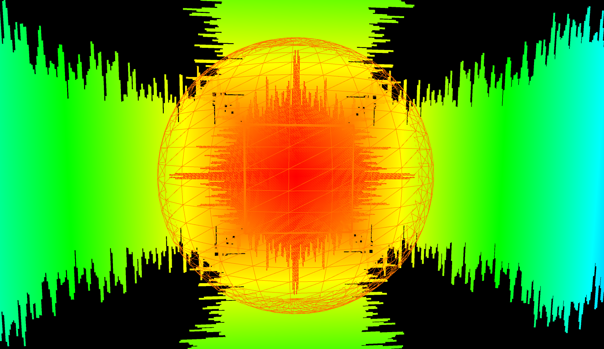
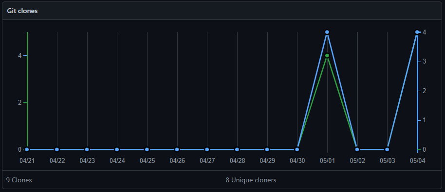

# Music Visualiser Project
Name: Luke O'Shea Scanlan

Student Number: C19300696

# Description of the assignment
Visuals of which respond to the amplitude of the inputted music.

# Instructions
All the user has to do is Compile and Run the file, 
the program will begin playing the music and the 
appropriate visual effects 

# How it works
The program takes samples from the mp3 file, from which we Map()
the amplitude to give us a relative colour, stroke and/or size for example:

```Java
PApplet.map(mv.getSmoothedAmplitude(), 1, 0, 255, 0), 255, 255)
```

This means that an amplitude of X-Meters is X-Colour


# What I am most proud of in the assignment
I am seriously happy with my loading screen/bar, 
although it is just theater, it called for a considerable 
amount of trial and error. I was eventually able to complete it 
will help and consulting with the Bullet Class from our YASC 
program earlier in the year.

## Prototypes (Honourable mentions)
Theses are some of the prototypes I worked with but didn't end up including:





It seems that my repository was also cloned which is a shame:

